# API сервис сокращения ссылок, проект 3 и 4.

Сервис позволяет сокращать ссылки, просматривать статистику по профилю и ссылкам, управлять своими ссылками.
Все обязательные требования реализовал, и думаю что смог отобразить через примеры запросов.
### Стек 
* Фреймворк: FastAPI
* БД: PostgreSQL (asyncpg, SQLAlchemy)
* Кэширование: Redis
* Авторизация: fastapi-users
* Миграции: Alembic
* Тестирование: pytest, pytest-mock, pytest-cov, httpx, Locust

### Мои решения и доп функции

* При запросе короткой ссылки API сначала обращается в Redis, и если url в кэше, происходит мгновенный редирект
* Вместо Celery, для авто очистки старых ссылок я решил использовать цикл asyncio запуская через lifespan FastAPI. Цикл раз в 24 часа просыпается, очищает БД и кэш от истекших ссылок или тех, по которым не кликали больше 30 дней
* Добавил возможность получить список всех своих ссылок, а также запросы массового удаления или обновления своих ссылок 

### Примеры запросов
1. **Регистрация и Авторизация:**  

я ввел уже существующего пользователя, и мы получили ответ что уже такой есть
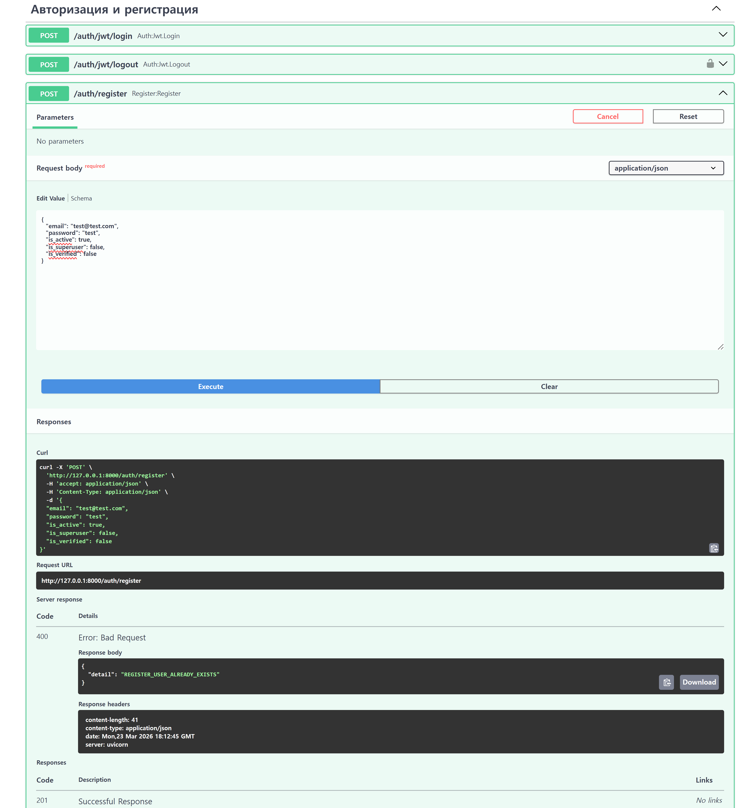

успешный логин через эти же данные
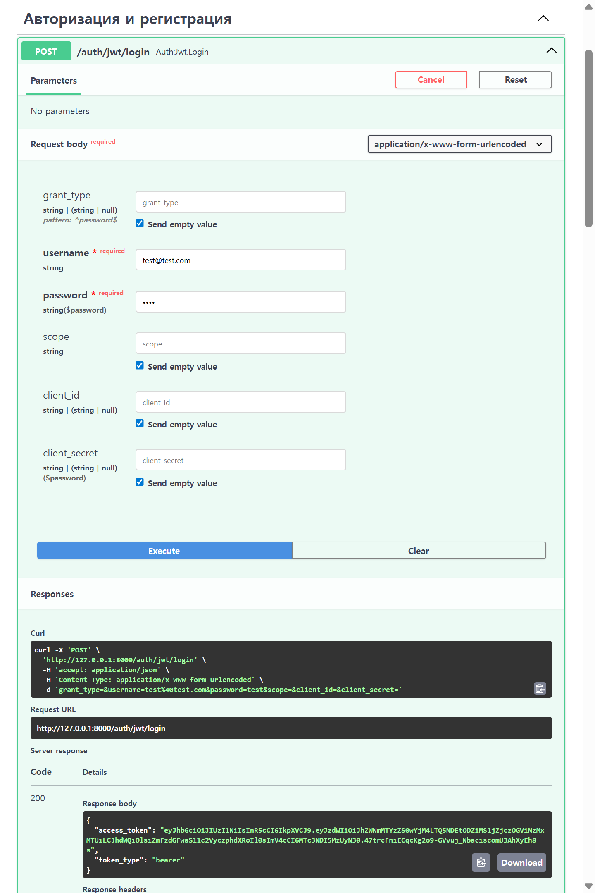
2. **Создание короткой ссылки:**  

задаем url, кастомный шорт код, и срок годности ссылки
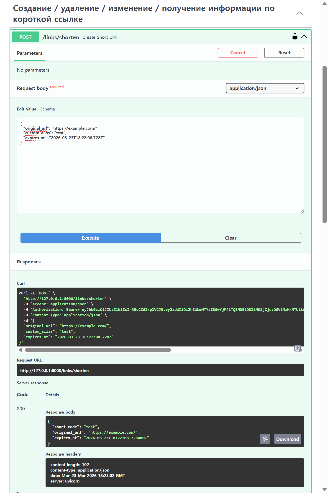

3. **Операции с ссылкой:**  

редирект прямо внутри try it out в swagger не сработает, там выдает ошибку Failed to fetch из за CORS.
Поэтому просто вручную вбиваю в строку браузера адрес сервиса с созданным шорт кодом.
Однако в обоих случаях мы получаем положительный респонс

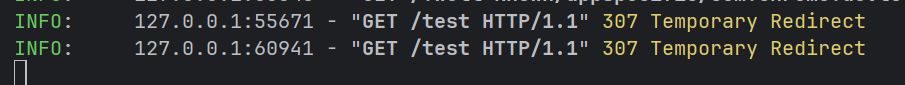  

обновление шорт кода другим url
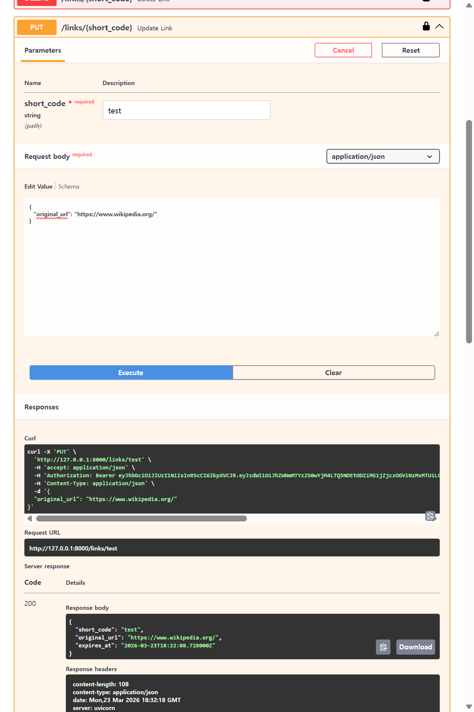  

удаление короткой ссылки
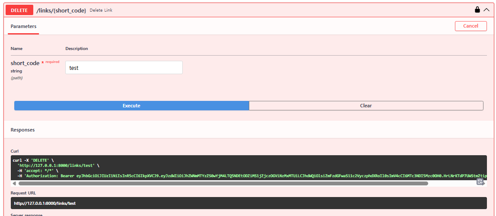  

делаем поиск по шорт коду, который только что удалили, получаем что не найдена
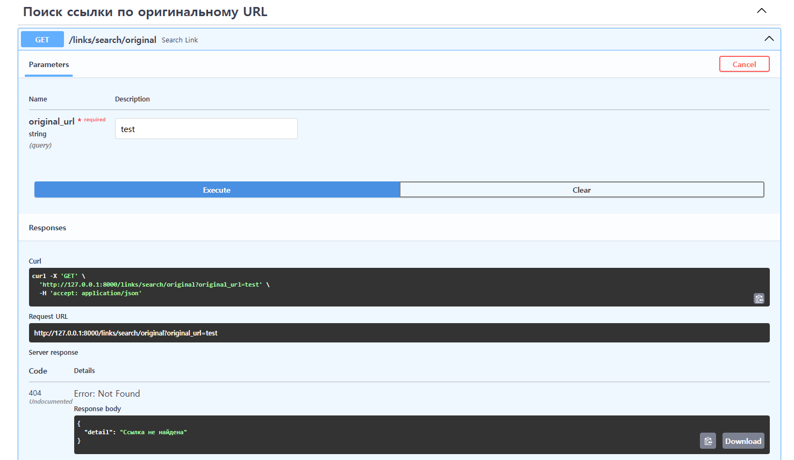  

создал другой шорт код пару раз перешел, и сделал запрос на статистику по нему
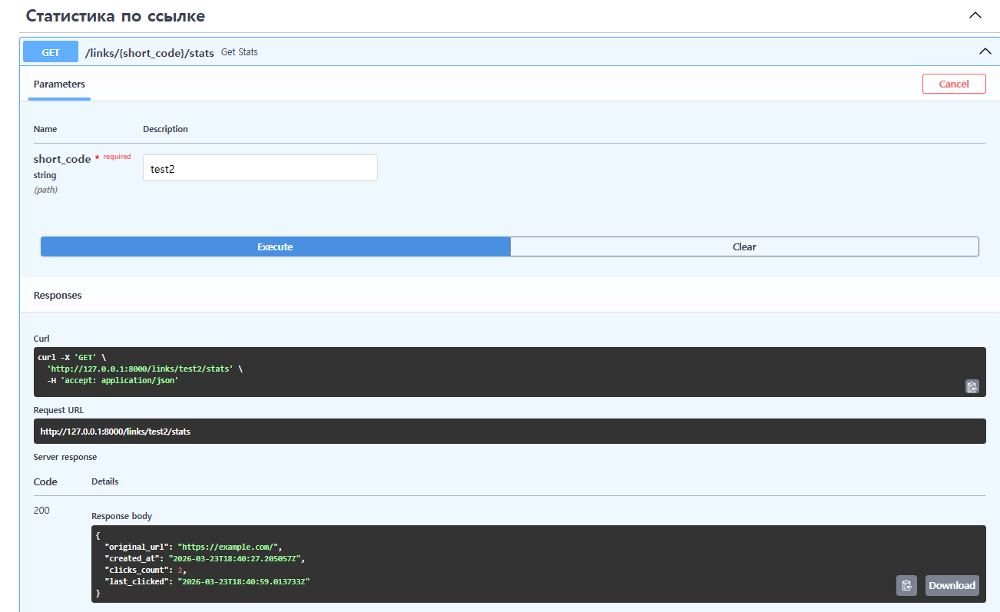  

поиск шорт кода по url
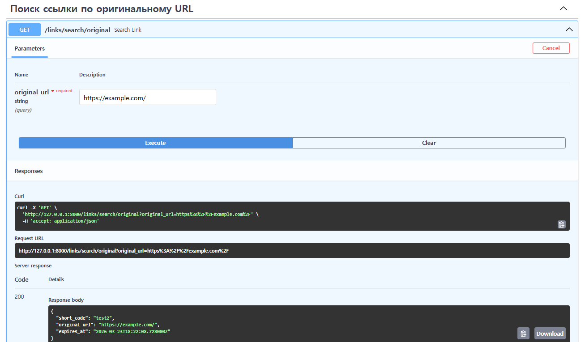  

делаем запрос на свой профиль, получаем свой email и все привязанные активные шорт коды
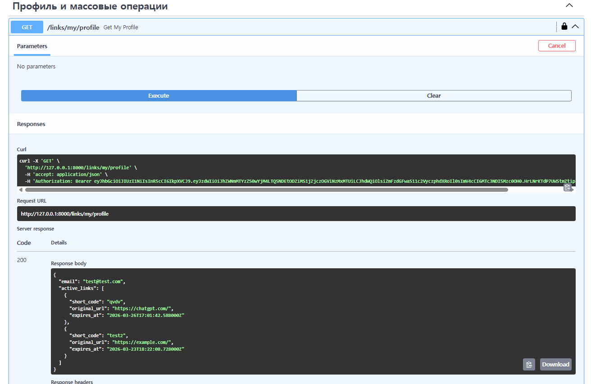  

обновляем url и дату истечения всех своих ссылок, если значения не менять, то останется как было, чтобы можно было изменить только что-то одно
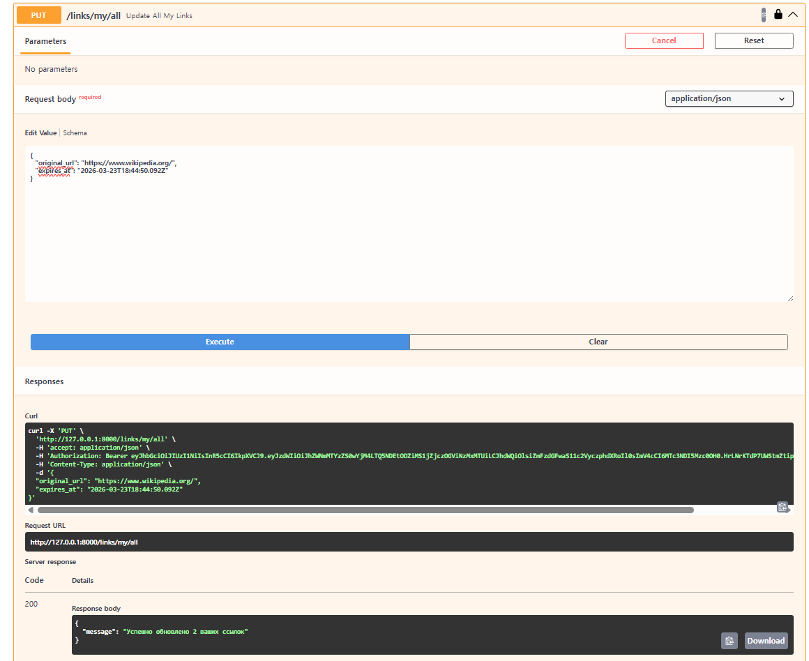

удаляем все свои ссылки
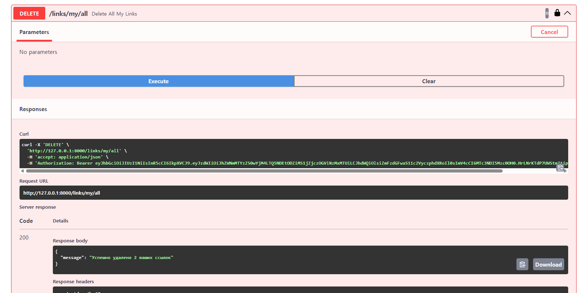  

## Инструкция по запуску

### Локальный запуск
Склонируйте репозиторий и cd в папку с проектом:
```bash
   git clone https://github.com/Kcemetra/f_api.git
```

Запустите PostgreSQL и Redis:

```bash
    docker-compose up -d 
```

Создайте venv и установите зависимости:
```bash
    python -m venv .venv
    source .venv/Scripts/activate
    pip install -r requirements.txt
```
Примените миграции и запустите сервис:
```bash
    alembic upgrade head
    uvicorn src.main:app --host 127.0.0.1 --port 8000 --reload
```
Тестирование API по адресу: http://127.0.0.1:8000/docs

### Деплой на Render

Создайте Web Service на Render, выбрав окружение Docker, и подключив репозиторий или вручную загрузить папку проекта.  
Подключите PostgreSQL и Redis в Render.  
Пропишите переменные окружения в настройках render: DB_USER, DB_PASSWORD, DB_HOST, DB_PORT, DB_NAME, REDIS_URL, SECRET_KEY.  
И можно делать деплой, все остальное поставится само за счет докерфайла.

## Тестирование 
В проекте реализовано функциональное и нагрузочное тестирование. Вместо тестовой БД, я решил просто всё мокировать через pytest-mock.  
Отчет по покрытию сгенерирован в папке htmlcov/  
Запустить тесты можно в корне проекта командой:
```bash
    pytest tests/ --cov=src --cov-report=html
```  
Прикладываю скриншоты отчета
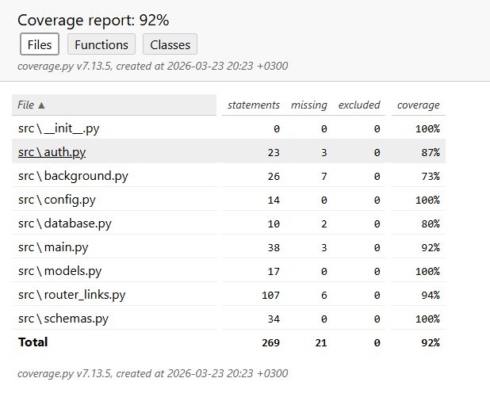  
Нагрузочное тестирование пытается нагрузить сервис через массовое создание случайных шорт кодов, а также через массовые не валидные get запросы.  
Запуск нагрузочных тестов  
```bash
    locust -f tests/locustfile.py
```
Скриншоты отчета Locust
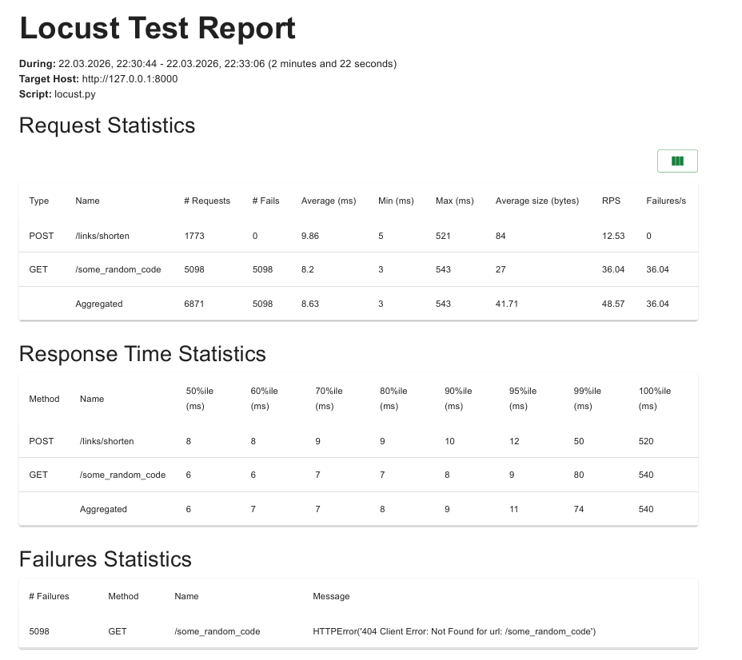
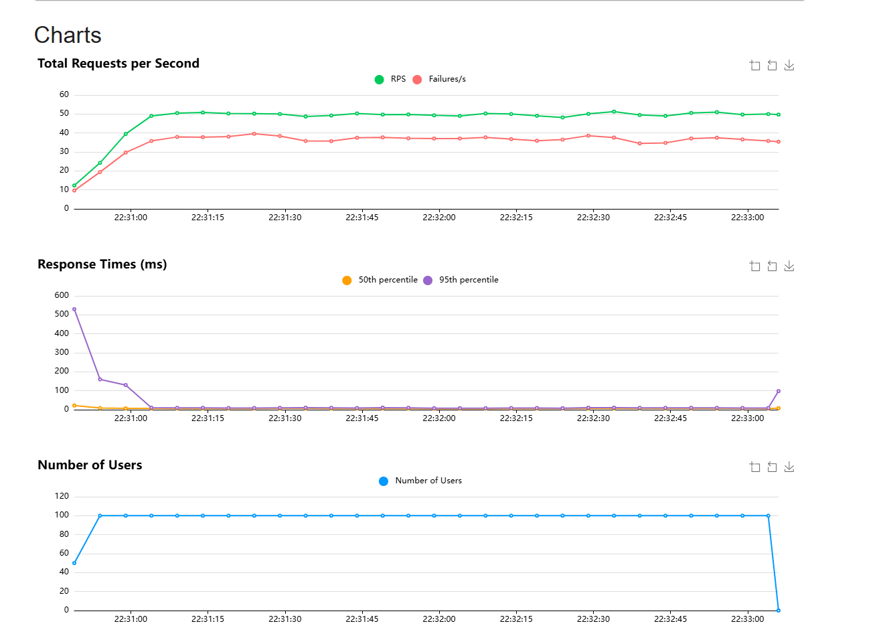
